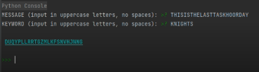

# VIGENERE CIPHER
Assignment 2 with commit and readme

A program that asks the user for the plaintext (all uppercase letters, no spaces) and the keyword (all uppercase letters) and produce the ciphertext using the Vigenère Cipher

## The Vigenère Cipher works as follows:

Your key is a keyword, which you then translate into corresponding letter values 0 – 25. Then, to encrypt, write your message on one row (letters 0 – 25), and repeatedly write the keyword below it, adding each column, taking the result mod 26. These resultant numbers are the ciphertext. 

Here is a small example:

Message: LETSGOTOTHESHOW: 11 4 19 18 6 14 19 14 19 7 4 18 7 14 22

Key: TICKET: 19 8 2 10 4 19  19 8 2 10 4 19  19 8 2

Add: 30 12 21 28 10 33 38 22 21 17 8 37 26 22 24

Mod: 4 12 21 2 10 7 12 22 21 17 8 11 0 22 24

Ciphertext: E M V C K H M W V R I L A W Y

# Example output

# How To Use / Run
1. Install Python on your computer to run the code. You can download its latest version here: https://www.python.org/downloads/ 
2. Copy the code from the repository. 
3. Open an IDE and paste the code. 
4. Save the file with a .py extension. 
5. Run the code. 
6. It will ask you to enter an encrypted message. Press Enter after inputting your message.
7. The decrypted text will be displayed.
8. If you want to repeat the Decryption just type "YES" if not Type "NO" and after that the program will end and the word "Thank you !!" will appear.
